# Кластеризация
## Задача кластеризации
Имеется:
- обучающая выборка **Xl = {x1, .., xl}** из X
- функция расстояния между объектами **ρ(x, x')**

Требуется:
- разбить выборку на непересекающиеся подмножества, называемые кластерами,
так, чтобы каждый кластер состоял из объектов, близких по метрике ρ, а объекты разных кластеров существенно отличались
- при этом каждому объекту **xi** из **Xl** приписывается номер кластера **yi**

## Определение
Алгоритм кластеризации -- это функция **a: X -> Y** , которая
любому объекту **x из X** ставит в соответствие метку кластера **y ∈ Y**.
Множество меток Y в некоторых случаях известно заранее, однако чаще ставится задача определить оптимальное число кластеров, с точки зрения того или иного критерия качества кластеризации.

    Не существует однозначно наилучшего критерия качества кластеризации

## Цели кластеризации
- Упростить дальнейшую обработку данных, разбить множество **Xℓ**
на группы схожих объектов чтобы работать с каждой группой в отдельности
*(задачи классификации, регрессии, прогнозирования)*
- Сократить объём хранимых данных, оставив по одному представителюот каждого кластера
*(задачи сжатия данных)*
- Выделить нетипичные объекты, которые не подходят ни к одному из кластеров
*(задачи одноклассовой классификации)*
- Построить иерархию множества объектов
*(задачи таксономии)*

## Типы кластерных структур

| Пример | Описание |
|----------------|-|
|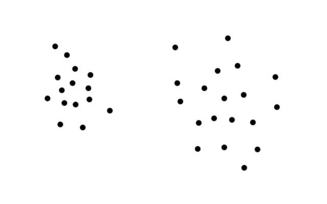|**Сгущения**: внутрикластерные расстояния, как правило, меньше межкластерных|
|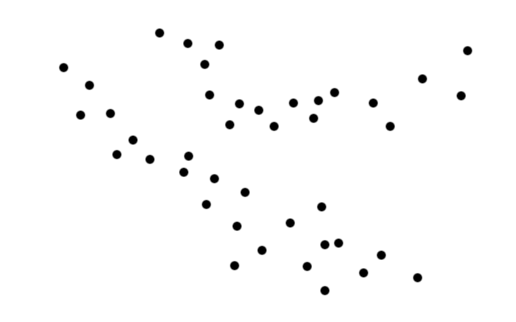|**Ленты**: для любого объекта найдётся близкий к нему объект того же кластера, в то же время существуют объекты одного кластера, которые не являются близкими|
|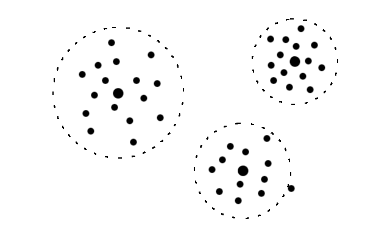|**Кластеры с центром**: в каждом кластере найдётся объект, такой, что почти все объекты кластера лежат внутри шара с центром в этом объекте|
|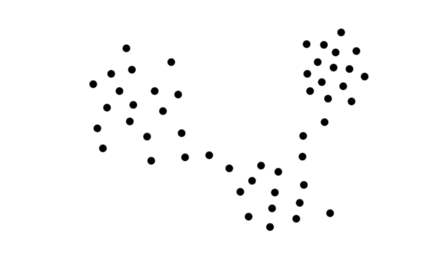|Кластеры могут соединяться перемычками, что затрудняет работу многих алгоритмов кластеризации|
|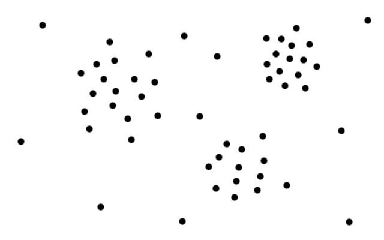|Кластеры могут накладываться на разреженный фон из редких нетипичных объектов|
|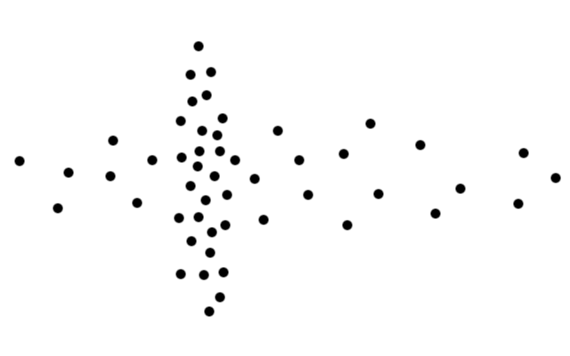|Кластеры могут перекрываться|
|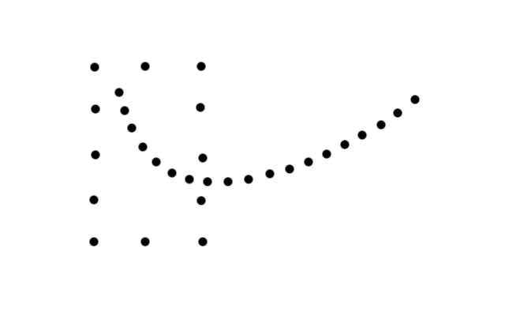|Кластеры могут образовываться не по принципу сходства, а по каким-либо иным, заранее неизвестным, свойствам объектов. Стандартные методы кластеризации здесь бессильны|
|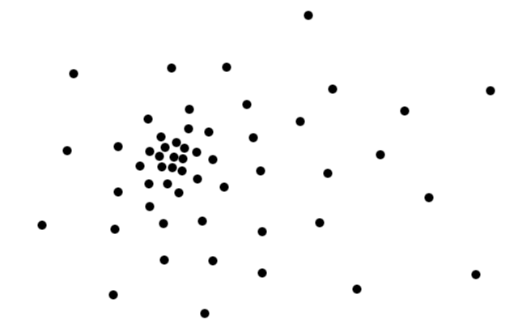|Кластеры могут вообще отсутствовать. В этом случае надо применять не кластеризацию, а иные методы анализа данных|

## Эврестические графовые алгоритмы
Обширный класс алгоритмов кластеризации основан на представлении выборки в виде графа.
Вершинам графа соответствуют объекты выборки, а рёбрам -- попарные расстояния
между объектами **ρij = ρ(xi, xj)**.

### Алгоритм выделения связных компонент
Задаётся параметр **R** и в графе удаляются все рёбра (i, j),
для которых **ρij > R**.
Соединёнными остаются только наиболее близкие пары объектов.
Идея алгоритма заключается в том, чтобы подобрать такое значение
**R ∈ [min ρij , max ρij]**,
при котором граф развалится на несколько связных компонент.
Найденные связные компоненты -- и есть кластеры.

*Связной компонентой графа* называется подмножество его вершин,
в которомлюбые две вершины можно соединить путём, целиком лежащим в этом подмножестве.
Для поиска связных компонент можно использовать стандартные
алгоритмы поиска в ширину (алгоритм Дейкстры) или поиска в глубину.

### Алгоритм кратчайшего незамкнутого пути
Алгоритм строит граф из l−1 рёбер так, чтобы они соединяли все l точек
и обладали минимальной суммарной длиной.
Такой граф называется кратчайшим незамкнутым путём (КНП),
минимальным покрывающим деревом или каркасом.
Доказано, что этот граф строится с помощью несложной процедуры,
соответствующей шагам 1–4 [Алгоритма выделения связных компонент](#алгоритм-выделения-связных-компонент).
На шаге 5 удаляются K − 1 самых длинных рёбер, и связный граф распадается на K кластеров.

В отличие от предыдущего алгоритма, число кластеров K задаётся как входной параметр.
Его можно также определять графически, если упорядочить все расстояния,
образующие каркас, в порядке убывания и отложить их на графике.
Резкий скачок вниз где-то на начальном (левом) участке графика покажет
количество наиболее чётко выделяемых кластеров.

Этот алгоритм, как и предыдущий, очень прост и также имеет ограниченную применимость.
Наличие разреженного фона или перемычек приводит к неадекватной кластеризации.
Другим недостатком КНП является высокая трудоёмкость --
для построения кратчайшего незамкнутого пути требуется **O(l3)** операций.

## Функционалы качества кластеризации
Существует много разновидностей функционалов качества кластеризации,
но нет "самого правильного" функционала.
Каждый метод кластеризации можно рассматривать как точный или приближённый
алгоритм поиска оптимума некоторого функционала.

Среднее внутрикластерное расстояние должно быть как можно меньше:

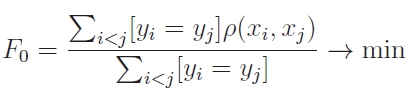

Среднее межкластерное расстояние должно быть как можно больше:

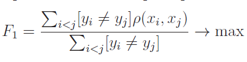

Если алгоритм кластеризации вычисляет центры кластеров **μy, y ∈ Y**,
то можно определить функционалы, вычислительно более эффективные.

Сумма средних внутрикластерных расстояний должна быть как можно меньше:

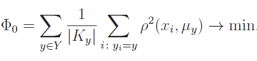

где **Ky = {xi ∈ Xl | yi = y}** -- кластер с номером y.

Сумма межкластерных расстояний должна быть как можно больше:

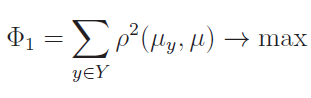

где **μ** -- центр масс всей выборки.

На практике вычисляют отношение пары функционалов,
чтобы учесть как межкластерные, так и внутрикластерные расстояния:

**F0/F1 -> min, либо Ф0/Ф1 -> min**

## Статические алгоритмы
Статистические алгоритмы основаны на предположении, что
кластеры неплохо описываются некоторым семейством вероятностных распределений.
Тогда задача кластеризации сводится к разделению смеси распределений по конечной выборке.
### EM-алгоритм
### Метод k-средних
### Кластеризация с частичным обучением