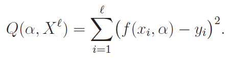
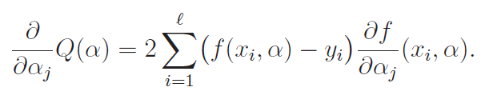
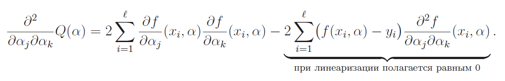
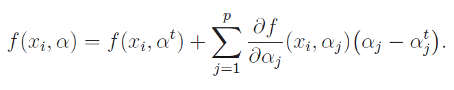
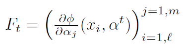
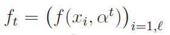
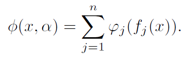

# Нелинейные методы восстановления регрессии

Общая идея во всех этих случаях одна: нелинейная задача сводится к решению последовательности более простых линейных задач.

## Нелинейная модель регрессии
* **f(x, a)** -- нелинейная модель регрессии
* **a** -- вектор параметров (a из **Rp**)

Задача: минимизировать функционал качества:

Для этого используем
### метод Ньютона–Рафсона:
1. Задаем начальное **a0 = (a00 .. a0p)**
1. **at+1 = at - ht(Q''(at))-1 * Q'(at)**

где
* **Q'(at)** -- градиент функционала Q в точке **at**
* **Q''(at)** -- функционала Q в точке **at**
* **ht** -- величина шага (параметр)

Компоненты градиента:

Компоненты гессиана:

*Основная сложность метода Ньютона–Рафсона заключается в обращении гессиана на каждой итерации.*

Более эффективным в плане вычисления является
### метод Ньютона-Гаусса
Если f достаточно гладкая (дважды дифф-ая), то её можно линеаризировать в окрестности at:

Тогда вторые слагаемые в гессиане равны нулю и не нужно вычислять вторые производные. В остальном метод не отличается от метода Ньютона–Рафсона.

Введем следующие обозначения:
* Матрица первых производных на t-й итерации:

* Вектор значений аппроксимирующей функции на t-й итерации:

Тогда формула итерации метода Ньютона–Рафсона принимает вид:

**at+1 = at - ht(FtTFt)-1 * FtT(ft - y)**

В правой части записано решение стандартной задачи многомерной линейной
регрессии. Таким образом, в методе Ньютона–Гаусса нелинейная регрессия сводится к последовательности линейных регрессионных задач.

## Нелинейные одномерные преобразования признаков
Если линейная модель для задачи не очень, можно попробовать сделать линейное преобразование и построить модель на нём:

