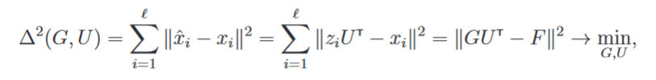
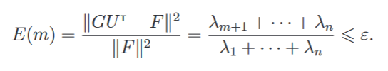

# Метод главных компонент (Principal Component Analysis)
### Зачем:
1. Решает проблему мультиколлинеарности
1. Получает минимальное количество признаков из исходных
1. Определяет эффективную размерность исходных данных

### Задача:
* **x1 .. l** -- объекты;
* **l** -- количество объектов;
* **f1 .. n** -- числовые признаки объектов;
* **n** -- количество признаков каждого объекта;

Матрица **F**l x n -- матрица признаков объектов. F[i][j] = j-ый признак i-го элемента: **fj(xi)**.

Матрица **G**l x m -- новая матрица описания признаков объектов, при этом **m < n**. Тогда G[i][j] = gj(xi). Новые объекты обозначим z1 .. l.

Исходные признаки можно восстановить из **z** линейным преобразованием. **x^ = z * UT**. x^ должно минимально отличаться от x при выбранном m.

Необходимо найти такие G и U.

||A||2 = trAAT = trATA, где tr -- след матрицы (сумма элементов главной диагонали). Ранг (rk) G и U равен m.

### Теорема
Если m <= rk F, то минимум ∆2(G, U) достигается, когда столбцы матрицы U есть собственные векторы FTF, соответствующие m максимальным собственным значениям. При этом G = FU, матрицы U и G ортогонмальны.

## Связь с сингулярным разложением
Если **m = n**, то **∆2(G, U) = 0**.
В этом случае представление **F = GUT** является точным и совпадает с сингулярным разложением: **F = GUT = VDUT**, если положить **G = VD** и **Λ = D2**. При этом матрица V ортогональна: **VTV = Im**.

Если **m < n**, то представление **F≈GUT** является приближённым.
Сингулярное разложение матрицы GUT получается из сингулярного разложения матрицы F путём обнуления **n − m** минимальных собственных значений.

## Преобразование Карунена–Лоэва.
Диагональность матрицы **GTG = Λ** означает, что новые признаки **g 1 .. m** не коррелируют на обучающих объектах.
Ортогональное преобразование U называют декоррелирующим или преобразованием Карунена–Лоэва.
Если **m = n**, то прямое и обратное преобразование вычисляются с помощью одной и той же матрицы U: **F = GUT** и **G = FU**.

## Эффективная размерность.
Главные компоненты содержат основную информацию о матрице F.
Число главных компонент m называют также эффективной размерностью задачи.
На практике её определяют следующим образом.
Все собственные значения матрицы **FTF** упорядочиваются по убыванию:
**λ1 >= ... >= λn >= 0**.
Задаётся пороговое значение ε из **[0, 1]**, достаточно близкое к нулю, и определяется наименьшее целое m, при котором относительная погрешность приближения матрицы F не превышает ε:

